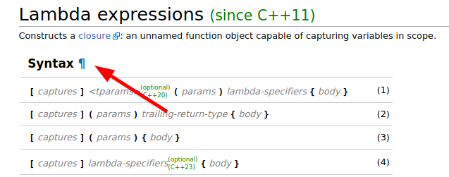

# cppref-hashtag

A tampermonkey script that adds Python-doc-like links to [cppreference](https://cppreference.com/), making sharing cppref links easier.

## Usage

Install from [Greasy Fork](https://greasyfork.org/en/scripts/427790-cppref-hashtag).
